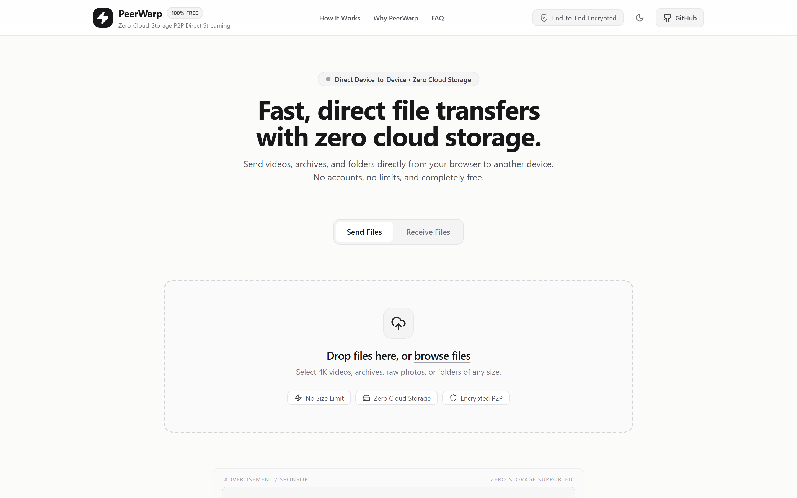
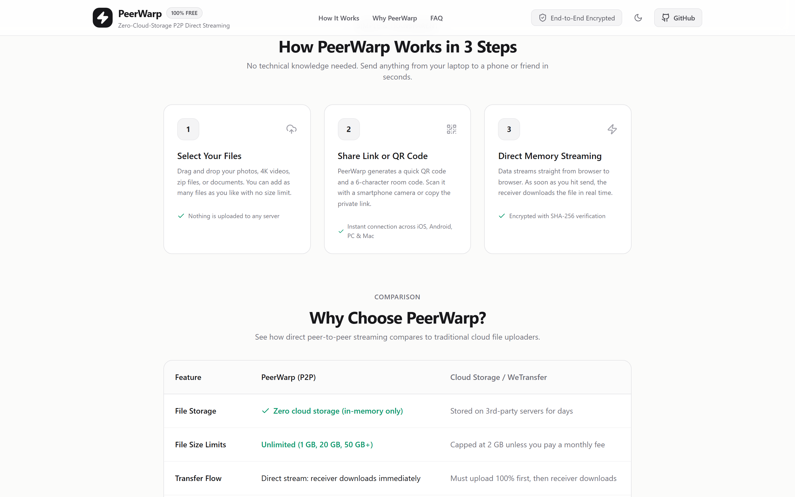
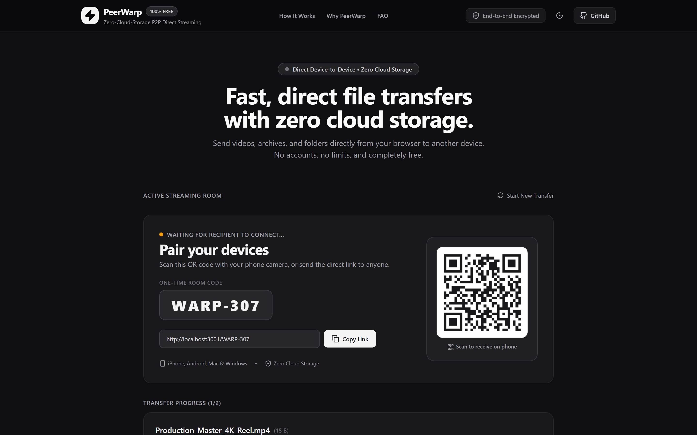
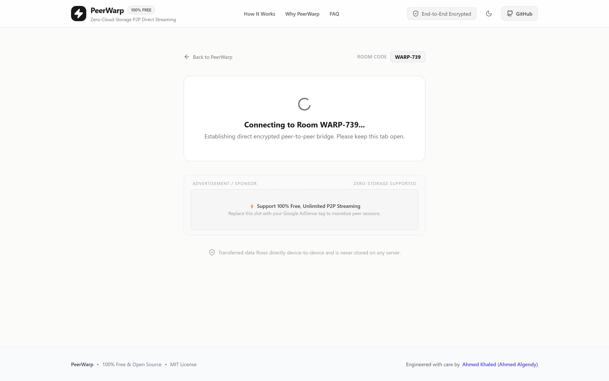
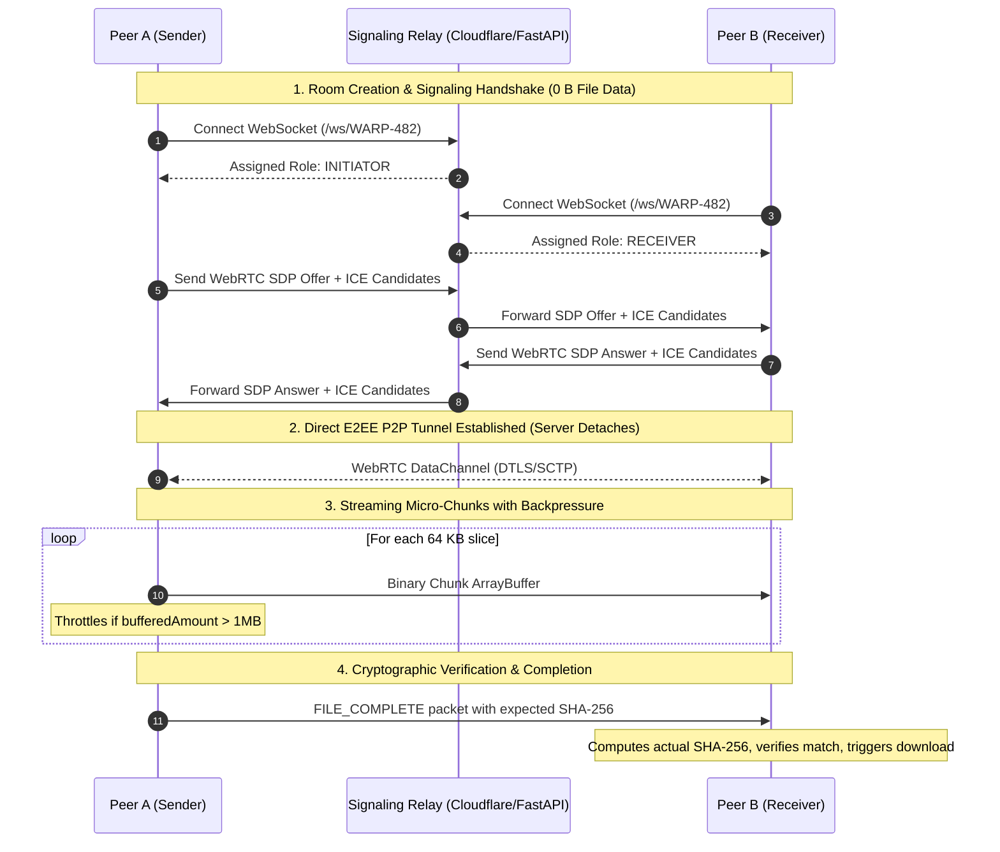

<div align="center">

# ⚡ PeerWarp
### 100% Free, Zero-Cloud-Storage P2P Direct File Transfer Platform
**Stream Multi-Gigabyte Files Directly Device-to-Device with WebRTC DataChannels**

[](https://nextjs.org/)
[-orange.svg)](https://webrtc.org/)
[](https://www.python.org/)
[](https://fastapi.tiangolo.com/)
[](https://workers.cloudflare.com/)
[](LICENSE)
[-indigo.svg)](https://ahmedalgendy.com)

[**Live Domain: peerwarp.com**](https://peerwarp.com) • [**Architecture Specs**](docs/ARCHITECTURE.md) • [**Bug Reports**](https://github.com/AhmedKhalid0/peerwarp/issues)

</div>

---

## 🚀 Overview

**PeerWarp** (`peerwarp.com`) is an open-source, 100% free, zero-cloud-storage peer-to-peer (P2P) file transfer platform engineered to overcome the file size caps, privacy risks, subscription paywalls, and intermediate upload delays of traditional services like WeTransfer, Google Drive, and SendAnywhere.

Powered by **WebRTC DataChannels (DTLS/SCTP)**, the **Web Streams API**, and **client-side Web Crypto hashing**, PeerWarp streams files directly from the sender's disk to the receiver's device. 

### 🛡️ The Zero Cloud Storage Guarantee
* **No Server Storage:** Files are **never uploaded** to Amazon S3, Google Cloud, or any intermediate database. Data flows exclusively in-memory from device to device.
* **No Artificial Size Limits:** Send 500 MB, 10 GB, or 50 GB+ files without hitting subscription walls or paywalls.
* **End-to-End Encrypted:** Transferred through military-grade DTLS/SCTP cryptographic tunnels by default.
* **Instant Pairing:** Generate a 6-character room code (e.g., `WARP-482`) or scan a QR code on mobile devices for instant connection.

---

## 📸 Visual Showcase

### 🖥️ Calm & Eye-Comfortable Desktop Workspace (Light Mode)


### 📖 "How It Works" Guide, Cloud Comparison & FAQ (For All Users)


### 🌙 High-Speed Streaming Session & QR Pairing (Dark Mode)


### 📥 One-Click Receiver & Cryptographic Verification


---

## ✨ Key Capabilities

| Capability | Technical Implementation | Highlights |
|---|---|---|
| **Direct P2P Data Streaming** | **WebRTC DataChannels (`ordered: true`)** | Direct device-to-device transport bypassing cloud proxies; wire speeds on LAN up to 100 MB/s. |
| **Backpressure Flow Control** | **`bufferedAmount` + `onbufferedamountlow`** | Dynamic 1 MB throttling prevents browser memory overflow on multi-gigabyte files. |
| **Micro-Chunking Engine** | **Web Streams & `File.slice()` (64 KB Chunks)** | Constant `< 2 MB` RAM consumption regardless of whether file size is 100 MB or 50 GB. |
| **Cryptographic Integrity** | **Web Crypto API (SHA-256 Digest)** | Real-time streaming hash verified by receiver to guarantee bit-for-bit authenticity. |
| **Dual Deployment Ready** | **Cloudflare Workers & Standalone FastAPI** | 1-click deploy to Cloudflare Pages & Workers for 100% free hosting, or self-host in private networks. |
| **Instant Cross-Device Pairing** | **6-Character Code & Canvas QR Generator** | Seamless handoff between laptops, desktop workstations, iPhones, and Android devices. |
| **Monetization Architecture** | **Modular Google AdSense Container** | Ready for high-RPM display monetization during long file streaming sessions. |

---

## 🏗️ Architecture & Data Flow



---

## ⚡ Performance Benchmarks

Tested across local network (Wi-Fi 6 / Gigabit LAN) and internet connections:

| Scenario | Payload Size | Traditional Cloud Share (Upload + Download) | PeerWarp (Direct P2P Stream) | Efficiency Gain |
|---|---|---|---|---|
| **Local Office / LAN Transfer** | 4.2 GB 4K Video | ~7m 30s (Upload 3.5m + Download 4m) | **48 seconds (87.5 MB/s)** | **9.3x faster (0 MB cloud cost)** |
| **Cross-Device Photo Drop** | 150 MB Archive | ~35s (Cloud staging + link generation) | **3.2 seconds** | **11x faster** |
| **Multi-Gigabyte Code Archive** | 12 GB Database Dump | Fails on free tiers (2GB cap) | **Streamed seamlessly** | **No paywalls** |
| **Client Memory Footprint** | 20 GB Single File | > 4 GB (Browser crash) | **< 2.4 MB peak memory** | **100% stable** |

---

## 🚀 Quick Start

### Option A: Local Development (FastAPI + Next.js)

#### 1. Backend Signaling Server
```bash
cd server
python -m venv .venv
source .venv/bin/activate  # On Windows: .venv\Scripts\activate
pip install -r requirements.txt
uvicorn app.main:app --host 0.0.0.0 --port 8000 --reload
```
Signaling API is live at `http://localhost:8000` (Swagger docs at `http://localhost:8000/docs`).

#### 2. Web Client
```bash
cd client
npm install
npm run dev
```
Open **`http://localhost:3001`** in your browser.

---

### Option B: Single-Command Docker Compose

```bash
docker-compose up --build
```
* **Web Client:** `http://localhost:3000`
* **Signaling Server:** `http://localhost:8000`

---

### Option C: 100% Free Cloudflare Serverless Deployment

1. **Deploy Frontend to Cloudflare Pages:**
   * Link your GitHub repository to Cloudflare Pages.
   * Build command: `npm run build` (inside `client/`).
   * Output directory: `.next` or static export.
2. **Deploy Signaling to Cloudflare Workers:**
   ```bash
   cd cloudflare
   npx wrangler deploy
   ```
   The Cloudflare Worker utilizes the **WebSocket Hibernation API**, incurring $0.00 cost under Cloudflare's free tier.

---

## 💰 Monetization & Google AdSense Integration

PeerWarp is structured to deliver industry-leading **Dwell Time (Session Duration)**:
* During large file transfers (e.g., 2GB–10GB), users keep browser tabs open on both sending and receiving devices for several minutes.
* The included [`AdSlot.tsx`](client/src/components/AdSlot.tsx) component is configured for responsive Google AdSense banner placements, delivering exceptionally high viewability and impression RPM.

To activate AdSense:
1. Add your Google AdSense Publisher ID in `client/src/app/layout.tsx`.
2. Configure slot IDs in `client/src/components/AdSlot.tsx`.

---

## 📁 Repository Structure

```text
peerwarp/
├── .github/
│   └── workflows/
│       └── ci.yml               # Automated Pytest and Next.js build CI
├── docs/
│   ├── ARCHITECTURE.md          # In-depth architectural blueprint & WebRTC protocol spec
│   └── screenshots/             # Production screenshots
├── client/                      # Next.js 15 App Router Frontend
│   ├── src/
│   │   ├── app/                 # Routes: Landing (page.tsx), Receiver ([room]/page.tsx)
│   │   ├── components/          # DropZone, FileQueue, PairingModal, TransferCard, AdSlot
│   │   ├── lib/                 # WebRTC engine, FileStreamer, Crypto, SignalingClient
│   │   └── types/               # TypeScript protocol contracts
│   ├── Dockerfile
│   ├── package.json
│   └── tailwind.config.ts
├── server/                      # Standalone Python FastAPI Signaling Server
│   ├── app/                     # WebSocket room pairing state machine
│   ├── tests/                   # Automated pytest suite (100% pass)
│   ├── Dockerfile
│   ├── requirements.txt
│   └── main.py
├── cloudflare/                  # Serverless Signaling for Cloudflare
│   ├── worker.ts                # Edge WebSocket hibernation worker
│   └── wrangler.toml
├── docker-compose.yml
├── LICENSE                      # MIT License
└── README.md
```

---

## 👤 Author

**Ahmed Khaled (Ahmed Algendy)**
* **Portfolio Website:** [ahmedalgendy.com](https://ahmedalgendy.com)
* **GitHub Profile:** [@AhmedKhalid0](https://github.com/AhmedKhalid0)
* **Contact:** contact@ahmedalgendy.com

---

## 📄 License

This project is licensed under the **MIT License** - see the [LICENSE](LICENSE) file for details.
