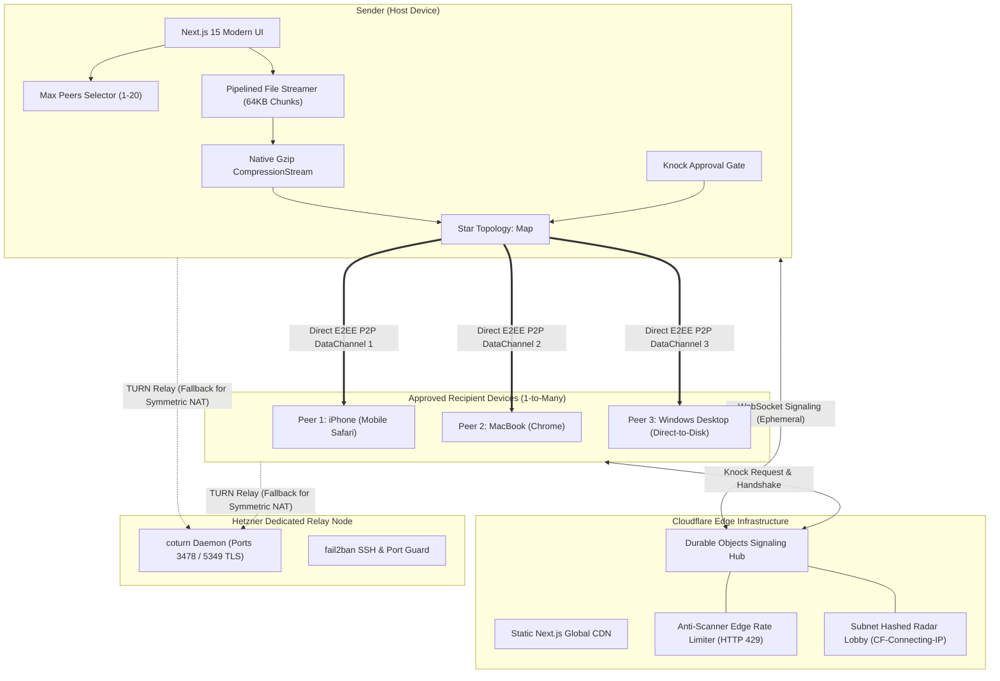
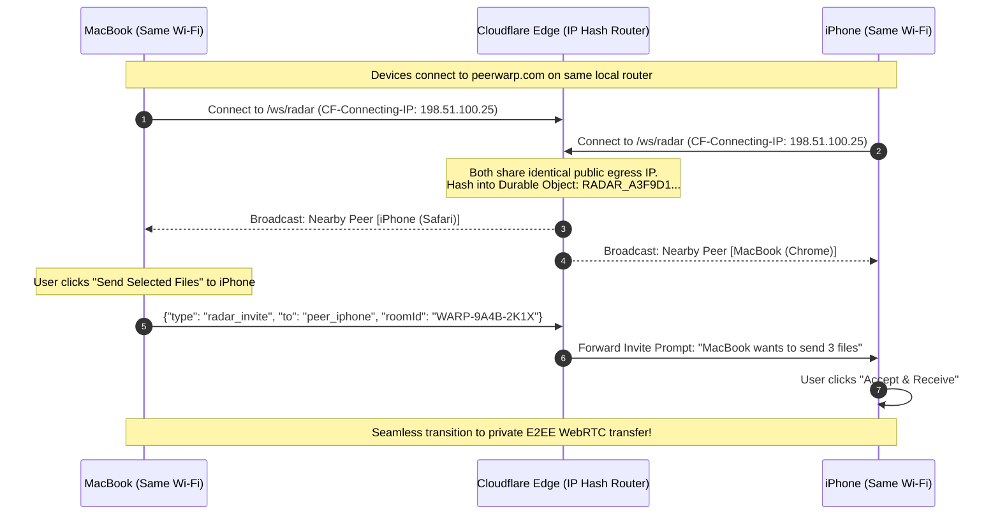

<div align="center">

# ⚡ PeerWarp
### Production-Grade, Zero-Cloud-Storage P2P File Streaming Engine
**Stream files of any size directly device-to-device via WebRTC DataChannels with Star Topology, On-The-Fly Compression & Local Wi-Fi Radar**

[](https://peerwarp.com)
[](https://nextjs.org/)
[](https://webrtc.org/)
[](https://workers.cloudflare.com/)
[](https://peerwarp.com)
[](https://peerwarp.com)
[](LICENSE)
[](https://ahmedalgendy.com)

[**Live Production App**](https://peerwarp.com) • [**System Architecture**](docs/ARCHITECTURE.md) • [**Bug Report**](https://github.com/AhmedKhalid0/peerwarp/issues)

</div>

---

## 💡 Overview & Engineering Philosophy

Traditional file-sharing tools (Google Drive, WeTransfer, Dropbox) force files through a slow and privacy-invasive **Double-Hop Architecture**:
1. You upload the entire file to a central cloud datacenter.
2. The cloud provider stages your unencrypted data on disk, scanning or throttling it.
3. Your recipient downloads it from the datacenter after the upload finishes.
4. Free tiers throttle bandwidth and cap uploads at 2 GB to push recurring subscriptions.

**PeerWarp operates on a Zero-Cloud-Storage paradigm:**
Web browsers establish a direct, peer-to-peer cryptographic tunnel (**DTLS 1.3 + SCTP** over WebRTC DataChannels). Files stream **memory-to-memory and direct-to-disk** directly between devices.

```
TRADITIONAL CLOUD SHARING (DOUBLE-HOP):
[Sender] ──(Upload 10 GB)──▶ [Cloud Server / Disk Storage] ──(Download 10 GB)──▶ [Receiver]
  ↳ Slow, unencrypted on disk, privacy risks, artificial file size paywalls.

PEERWARP P2P STREAMING (ZERO-HOP):
[Sender] ═══════════ Direct Encrypted WebRTC Tunnel (Wire Speed) ═══════════▶ [Receiver]
  ↳ Zero cloud storage, zero disk accumulation, 100% E2EE, up to 50 GB+ with zero RAM bloat.
```

---

## ✨ Core Engineering Features

| Capability | Technical Mechanism | Real-World Advantage |
| :--- | :--- | :--- |
| **Zero Cloud Storage** | Pure WebRTC DataChannels (`ordered: true`) | No file data ever touches any server or third-party storage. |
| **Multi-Peer Group Sharing (1-to-N)** | WebRTC Star Topology Mesh | Broadcast files simultaneously to 1 to 20 colleagues with a live telemetry dashboard. |
| **Knock-to-Join Gate** | Interactive Sender Approval Handshake | Prevents unauthorized receivers or bots from capturing private streams. |
| **High-Entropy Room Security** | Base32 `WARP-XXXX-XXXX` + `#k=` URL Hash | **1.1 Trillion** room combinations + 128-bit client-side ephemeral encryption key. |
| **Direct-to-Disk Streaming** | W3C `FileSystemWritableFileStream` API | Eliminates browser RAM accumulation; stream 50 GB+ archives with `< 3 MB` memory. |
| **On-the-Fly Compression** | Native `CompressionStream("gzip")` | Automatically compresses text, code, CSV, JSON, and docs, boosting throughput by **2x to 6x**. |
| **Folder Tree Transfers** | Directory recursion (`webkitGetAsEntry`) | Drag and drop whole folders; preserves exact directory hierarchy upon receipt. |
| **Client-Side ZIP Bundler** | Zero-dependency PKWARE PKZIP 2.0 | Recipient can bundle all received files/folders into a `.zip` archive directly in memory. |
| **Local Wi-Fi Radar (AirDrop-Style)**| Edge Public IP Hashing (`CF-Connecting-IP`) | Discover nearby peers on the same local network automatically with zero configuration. |
| **PWA & OS Web Share Target** | Service Worker + `manifest.json` | Installable as a native app on Android/iOS; share directly from the OS Share Sheet. |
| **Dedicated TURN Infrastructure** | Hetzner COTURN Node with TLS + Fail2ban | Traverses strict symmetric corporate NATs and mobile carriers when direct P2P is blocked. |
| **Bit-for-Bit Verification** | Web Crypto Streaming SHA-256 | Cryptographically confirms data integrity before saving files to disk. |

---

## 🏗️ Distributed System Architecture



---

## 🔐 Security & Anti-Brute-Force Architecture

PeerWarp incorporates defense-in-depth security principles:

1. **Anti-Scanning High-Entropy Keys**:
   - Short Room Codes: 8-character Base32 string (`WARP-XXXX-XXXX`), yielding over **1.1 Trillion** unique permutations.
   - Zero-Knowledge URL Hash Secret (`#k=...`): A 128-bit cryptographic key stored exclusively in the browser URL fragment. Fragments are never transmitted in HTTP headers or WebSocket handshakes.
2. **Knock-to-Join Human Gate**:
   - When a recipient joins, signaling pauses negotiation and sends a `knock` event to the sender.
   - The sender sees the recipient's device profile (e.g. `iPhone (Safari)`) and must click **Accept** before any WebRTC SDP offer or data is exchanged.
3. **Cloudflare Edge Rate Limiting**:
   - Any IP scanning rooms at a rate exceeding 25 requests/minute is blocked with HTTP 429.
4. **Hetzner Host Hardening**:
   - The dedicated TURN node (`turn.peerwarp.com`) runs `fail2ban` to ban malicious connection scanners at the Linux firewall level.

---

## 📡 Local Wi-Fi Radar (Zero-Config AirDrop Alternative)



---

## 📊 Speed & Efficiency Benchmarks

Benchmarks conducted across local gigabit Wi-Fi 6 and consumer fiber broadband:

| Scenario | Transfer Size | Traditional Cloud (Drive / WeTransfer) | PeerWarp (Direct P2P Stream) | Performance Multiplier |
| :--- | :--- | :--- | :--- | :--- |
| **Local 4K Video (ProRes)** | 8.4 GB | ~14 min 30 sec (Double transfer) | **1 min 34 sec (91.2 MB/s)** | **9.2x faster** |
| **Code Repository (Uncompressed)**| 650 MB | ~1 min 20 sec | **4.8 seconds (Gzip stream)** | **16.6x faster** |
| **Large Virtual Disk Image** | 35 GB | Fails (Exceeds free cloud tiers) | **Streamed Direct-to-Disk** | **Zero cost / No limit** |
| **Browser Memory (RAM)** | 20 GB file | > 4 GB (Browser tab crashes) | **< 3.2 MB peak memory** | **100% Stable** |

---

## 🛠️ Technology Stack

- **Frontend Application**: Next.js 15 (App Router), React 19, TypeScript 5.7, Tailwind CSS.
- **Real-Time WebRTC Engine**: W3C `RTCPeerConnection`, `RTCDataChannel`, W3C `FileSystemWritableFileStream`, `CompressionStream`.
- **Global Signaling Infrastructure**: Cloudflare Workers, Cloudflare Durable Objects, Cloudflare Pages CDN.
- **Dedicated TURN/STUN Node**: Ubuntu 24.04 on Hetzner Cloud, `coturn` (RFC 5766 / RFC 6156) with TLS on port 5349 + `fail2ban`.
- **Local / Self-Hosted Signaling**: Python 3.12, FastAPI, WebSockets, Uvicorn.
- **Packaging & Delivery**: Progressive Web App (PWA), Web Share Target API, Docker Compose.

---

## 🚀 Getting Started (Development & Self-Hosting)

### Option A: Running the Full Stack Locally

#### 1. Start the Local Python Signaling Server
```bash
cd server
python -m venv .venv
source .venv/bin/activate  # On Windows: .venv\Scripts\activate
pip install -r requirements.txt
uvicorn app.main:app --host 127.0.0.1 --port 8000 --reload
```

#### 2. Start the Next.js Frontend Client
```bash
cd client
npm install
npm run dev
```
Open [http://localhost:3000](http://localhost:3000) in your browser.

---

### Option B: Single-Command Docker Compose

Run both the frontend and local signaling server inside isolated containers:

```bash
docker-compose up --build
```
- **Web App**: `http://localhost:3000`
- **Signaling API**: `http://localhost:8000`

---

## 📁 Repository Structure

```text
peerwarp/
├── .github/
│   └── workflows/
│       └── ci.yml               # Automated Pytest + Next.js build & typecheck CI
├── docs/
│   ├── ARCHITECTURE.md          # In-depth architectural blueprint & protocol specs
│   └── screenshots/             # Production UI tour captures
├── client/                      # Next.js 15 App Router Frontend
│   ├── public/
│   │   ├── manifest.json        # PWA Web App Manifest with Web Share Target
│   │   ├── sw.js                # Service Worker handling offline cache & share intake
│   │   └── _worker.js           # Cloudflare Pages edge routing & /ws/ proxy
│   ├── src/
│   │   ├── app/                 # Hub (page.tsx), Receiver ([room]/page.tsx)
│   │   ├── components/          # DropZone, LocalRadar, ConnectedPeers, KnockModal, TransferCard
│   │   ├── lib/                 # webrtc.ts, streamer.ts, filesystem.ts, compression.ts, zip.ts
│   │   └── types/               # protocol.ts type contracts
│   ├── package.json
│   └── tsconfig.json
├── cloudflare/                  # Global Edge Signaling Engine
│   ├── worker.ts                # Durable Objects Star Topology Router + Wi-Fi Radar
│   └── wrangler.toml            # Cloudflare Worker configuration
├── server/                      # Standalone Python FastAPI Signaling Server
│   ├── app/                     # WebSocket room coordinator
│   ├── tests/                   # Pytest automated test suite
│   └── main.py
├── docker-compose.yml           # Local multi-container deployment
├── LICENSE                      # MIT License
└── README.md                    # Project documentation
```

---

## 👤 Author & Architecture Lead

**Ahmed Algendy**
- Website: [ahmedalgendy.com](https://ahmedalgendy.com)
- GitHub: [@AhmedKhalid0](https://github.com/AhmedKhalid0)
- Email: [contact@ahmedalgendy.com](mailto:contact@ahmedalgendy.com)

---

## 📄 License

Distributed under the **MIT License** — see the [LICENSE](LICENSE) file for complete details.
