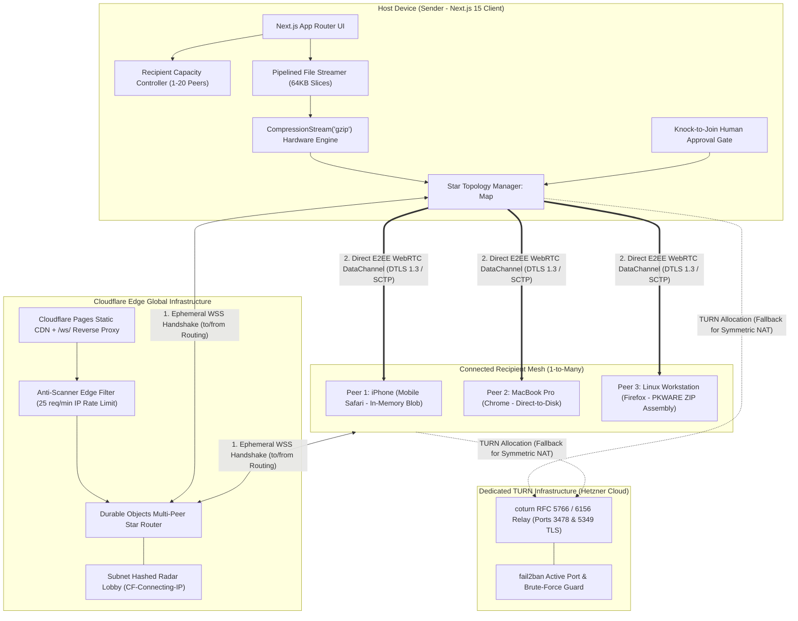

# PeerWarp Architectural Blueprint & Distributed System Design 🌐

**PeerWarp** ([peerwarp.com](https://peerwarp.com)) is an open-source, production-grade, zero-cloud-storage peer-to-peer (P2P) file streaming engine. It establishes direct cryptographic tunnels across browsers on mobile phones, laptops, and workstations without intermediate cloud staging.

---

## 1. High-Level Distributed Architecture



---

## 2. Signaling Protocol & State Machine

The signaling layer is strictly ephemeral and never handles file bytes. It coordinates WebRTC session descriptions (`offer`/`answer`) and ICE candidates.

### Envelope Data Contract
```typescript
export interface SignalingEnvelope {
  type:
    | "join" | "joined" | "offer" | "answer" | "ice_candidate"
    | "leave" | "peer_left" | "ping" | "pong" | "error"
    | "knock" | "approve_peer" | "reject_peer" | "peer_approved" | "peer_rejected"
    | "room_config" | "radar_join" | "radar_peers" | "radar_invite";
  roomId?: string;
  role?: "initiator" | "receiver";
  peerId?: string;
  from?: string;
  to?: string;
  payload?: any;
  message?: string;
  peerCount?: number;
  maxPeers?: number;
  deviceInfo?: string;
  requireApproval?: boolean;
  approved?: boolean;
}
```

### Star Topology Message Flow

1. **Host Initialization**:
   - Host establishes a WebSocket with `room_config` defining `maxPeers` (e.g. 5) and `requireApproval: true`.
2. **Knock Phase**:
   - Recipient connects to the room WebSocket. Signaling puts the peer in `pending_approval` and sends `{ type: "knock", peerId, deviceInfo }` to the host.
3. **Approval Handshake**:
   - The host displays the prompt. On clicking "Accept", host emits `{ type: "approve_peer", targetPeerId }`.
   - Signaling forwards `{ type: "peer_approved" }` to the recipient.
4. **Targeted WebRTC Negotiation**:
   - Host generates an SDP Offer addressed to `to: peerId`.
   - Signaling delivers the offer directly to the recipient socket.
   - Recipient answers back with `to: "host"`.
   - ICE candidates are exchanged with targeted `from`/`to` routing, preventing broadcast collisions.

---

## 3. High-Throughput Streaming Engine

### Adaptive Micro-Burst Flow Control
WebRTC DataChannels utilize an underlying SCTP buffer. Writing too rapidly causes browser memory spikes and tab crashes. PeerWarp implements dual-threshold flow control:

- **High Watermark (Buffered Limit)**: `512 KB`. Writing pauses when `channel.bufferedAmount > 524,288`.
- **Low Watermark (Drain Resume)**: `128 KB`. Streamer resumes upon receiving the browser `bufferedamountlow` event.
- **Chunk Sizing**: Fixed `64 KB` binary chunks, perfectly aligned with standard WebRTC SCTP maximum transmission units (MTU) to avoid fragmentation.

### Direct-to-Disk Architecture
For files exceeding 200 MB on supported desktop and Android browsers, PeerWarp switches from memory buffering to the W3C File System Access API:

```
Incoming SCTP Binary Chunk ──▶ Decompress (if gzip) ──▶ FileSystemWritableFileStream.write(chunk) ──▶ Local Disk
```
- **Result**: Zero RAM accumulation. A 40 GB video stream consumes less than 3.5 MB of heap memory.

### Zero-Dependency PKWARE ZIP Generation
When receiving directories or multi-file batches, the receiver generates a standard PKZIP 2.0 archive on the fly:
- **Local File Headers (`0x04034b50`)**: Contains MS-DOS timestamps and standard IEEE 802.3 CRC-32 checksums.
- **Central Directory (`0x02014b50`)**: Preserves POSIX relative paths (`assets/images/sample.png`).
- **End of Central Directory (`0x06054b50`)**: Built in memory and triggered as a single download.

---

## 4. Security & Cryptographic Model

| Threat Vector | Mitigation in PeerWarp |
| :--- | :--- |
| **Room URL Guessing / Crawlers** | 8-character Base32 short codes ($32^8 \approx 1.1 \times 10^{12}$ combinations) + 128-bit URL hash secret keys. |
| **Eavesdropping / Wiretapping** | Mandatory DTLS 1.3 encryption with AES-GCM 128/256-bit session ciphers on all DataChannels. |
| **Middleman Snooping** | Ephemeral keys `#k=...` remain in the browser URL fragment and are never sent over HTTP/WebSockets. |
| **Man-in-the-Middle File Tampering** | Bit-for-bit cryptographic verification using Web Crypto API streaming SHA-256 before saving to disk. |
| **DDoS / Scanner Flooding** | Cloudflare Edge Rate Limiting automatically returns HTTP 429 for IP scan bursts. |
| **TURN Relay Abuse** | Server runs behind Linux `fail2ban` banning unauthorized connection abusers. |

---

## 5. Network Fallback Matrix

```
[Peer Connection Attempt]
           │
           ▼
[ICE Candidate Discovery]
           │
     ┌─────┴─────────────────────────┐
     ▼                               ▼
[Host Candidates]            [Server Reflexive (STUN)]
     │                               │
     ▼                               ▼
[Direct LAN Connection]       [Direct WAN Connection (P2P)]
(Gigabit Speeds: 80-110 MB/s)  (Internet Speeds: 10-50 MB/s)
     │                               │
     └───────────────┬───────────────┘
                     │ (If Symmetric NAT / Corporate Firewall blocks direct P2P)
                     ▼
          [Relayed ICE Candidate (Hetzner COTURN)]
          (Dedicated Encrypted Relay: Wire Speed up to 10 Gbps)
```
