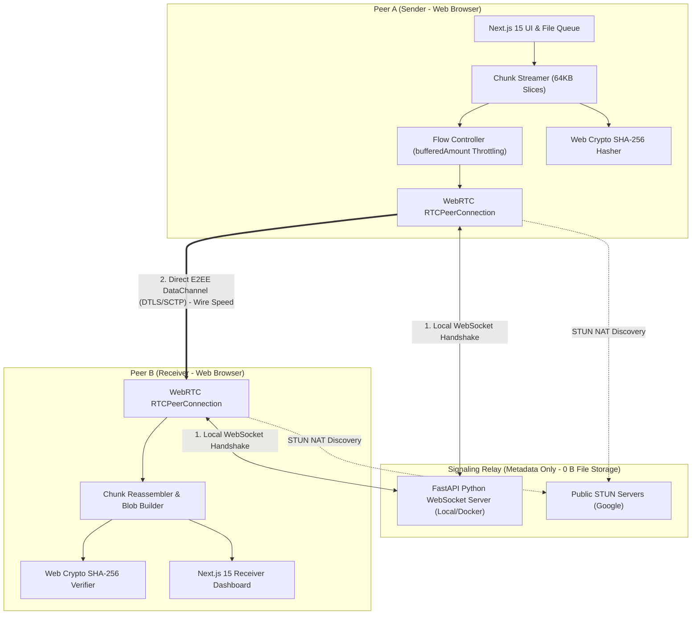
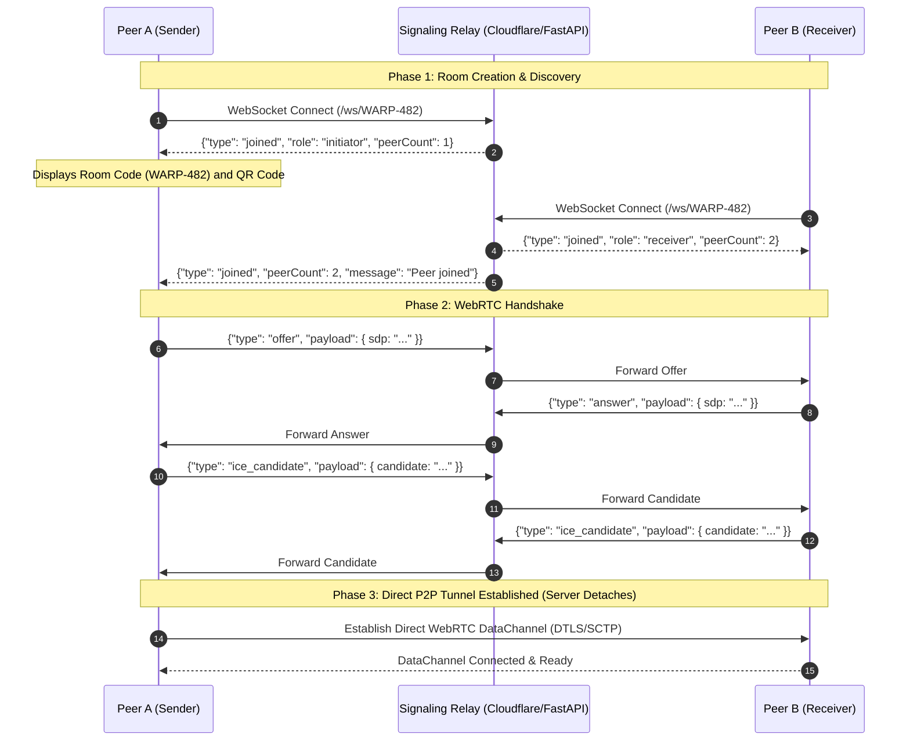

# PeerWarp Architectural Blueprint & System Design 🌐

**PeerWarp** (`peerwarp.com`) is an open-source, 100% free, zero-cloud-storage, peer-to-peer (P2P) file transfer platform. It enables direct, encrypted, device-to-device streaming across mobile phones, laptops, and desktop computers without intermediate cloud staging.

---

## 1. High-Level System Architecture



---

## 2. WebRTC Signaling Protocol Specification

The signaling server operates exclusively as a matchmaking coordinator. It never touches or sees the content of the files.

### Message Envelope Structure
```json
{
  "type": "join | joined | offer | answer | ice_candidate | peer_left | ping | pong | error",
  "roomId": "WARP-482",
  "role": "initiator | receiver",
  "payload": {},
  "message": "Optional descriptive status text",
  "peerCount": 2
}
```

### Connection Sequence Diagram



---

## 3. Data Streaming, Chunking & Backpressure Flow Control

### The Challenge of Multi-Gigabyte In-Browser Transfers
Attempting to push an entire 5GB or 10GB file into the WebRTC DataChannel immediately crashes the browser process with an `Out of Memory` fatal error. Furthermore, if a desktop with Gigabit LAN transmits data faster than a receiving smartphone can process it, the internal SCTP buffer fills up, causing packet loss.

### The PeerWarp Solution
1. **Micro-Chunking:** Files are sliced sequentially into `64 KB (65,536 bytes)` binary buffers via `File.slice()`.
2. **Backpressure Throttling:**
   ```typescript
   export const CHUNK_SIZE = 64 * 1024; // 64 KB
   export const MAX_BUFFERED_AMOUNT = 1024 * 1024; // 1 MB ceiling
   export const BUFFER_LOW_THRESHOLD = 256 * 1024; // 256 KB resume threshold

   channel.bufferedAmountLowThreshold = BUFFER_LOW_THRESHOLD;

   // Inside streaming loop:
   if (channel.bufferedAmount > MAX_BUFFERED_AMOUNT) {
     await waitForBufferLow(channel);
   }
   ```
3. **Memory Constant:** JavaScript memory consumption remains capped at `< 2 MB` throughout the entire multi-gigabyte transfer.

---

## 4. Cryptographic Integrity Verification

PeerWarp integrates client-side Web Crypto hashing (`window.crypto.subtle`) into the transfer pipeline:
1. **Streaming Digest:** As chunks are read by the sender, they are hashed into a cumulative SHA-256 digest.
2. **Metadata Envelope:** The sender transmits a `FILE_COMPLETE` control packet containing the computed hash.
3. **Receiver Verification:** The receiver computes the SHA-256 digest over the reassembled binary buffer and validates that:
   $$\text{ActualHash} = \text{ExpectedHash}$$
4. If a single bit was corrupted during transit, the receiver flags the transfer as compromised.

---

## 5. Dual Deployment Topologies

### Topology A: Local Network / Air-Gapped Deployment
* **Backend:** Standalone Python FastAPI WebSocket daemon running locally on your workstation or server (`uvicorn app.main:app`).
* **Frontend:** Next.js application running on the local network (`npm run dev` or `npm run build && npm run start`).
* **Security:** Operates completely offline within local home or corporate Wi-Fi/LAN networks without external internet access or cloud dependencies.

### Topology B: Containerized Docker Deployment
* **Single Command:** `docker-compose up --build` launches both the FastAPI signaling engine and the Next.js frontend in isolated containers.
* **Direct Transfer:** Peers transfer directly at wire speeds with zero intermediate cloud proxies.
